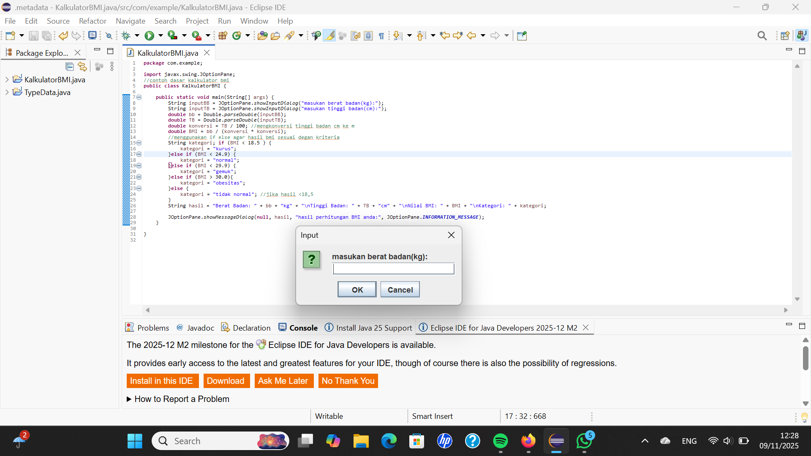

#  🧮Program Kalkulator BMI dengan JOptionPane

## 👤 Identitas
- **Nama:** HERLAN ALAN SUHERMAN
- **NIM:** I.2510319
- **Mata Kuliah:** Algoritma dan Pemrograman  

---

## 🧠 Deskripsi
Program ini menghitung **Indeks Massa Tubuh (BMI)** berdasarkan **berat badan (kg)** dan **tinggi badan (cm)** menggunakan **JOptionPane** untuk input dan output.  
Langkah program:
1. Pengguna memasukan berat badan dan tinggi badan
2. Program akan mengkonversi terlebih dahulu tinggi badan dari cm ke m
3. program menghitung hasil bmi 
4. Hasil ditampilkan dalam kotak dialog  

---

## 💻 Cuplikan Kode
```java
import javax.swing.JOptionPane;
//contoh dasar kalkulator bmi
public class KalkulatorBMI {

	public static void main(String[] args) {
		String inputBB = JOptionPane.showInputDialog("masukan berat badan(kg):");
		String inputTB = JOptionPane.showInputDialog("masukan tinggi badan(cm):");
		double bb = Double.parseDouble(inputBB);
		double TB = Double.parseDouble(inputTB);
		double konversi = TB / 100; //mengkonversi tinggi badan cm ke m
		double BMI = bb / (konversi * konversi);
		//menggunakan if else agar hasil bmi sesuai degan kriteria
		String kategori; if (BMI < 18.5 ) { 
			kategori = "kurus";
		}else if (BMI < 24.9) {
			kategori = "normal";
		}else if (BMI < 29.9) {
			kategori = "gemuk";
		}else if (BMI > 30.0){
			kategori = "obesitas";
		}else {
			kategori = "tidak normal"; //jika hasil <18,5 
		}
		String hasil = "Berat Badan: " + bb + "kg" + "\nTinggi Badan: " + TB + "cm" + "\nNilai BMI: " + BMI + "\nKategori: " + kategori;
		
		JOptionPane.showMessageDialog(null, hasil, "hasil perhitungan BMI anda:", JOptionPane.INFORMATION_MESSAGE);
	}

}

```

---

## 🔍 Hasil Uji Coba

### 💡 Input


### 📊 Output



---

## ✅ Kesimpulan
Program berhasil dijalankan dan menampilkan hasil bmi dengan benar.  

---
